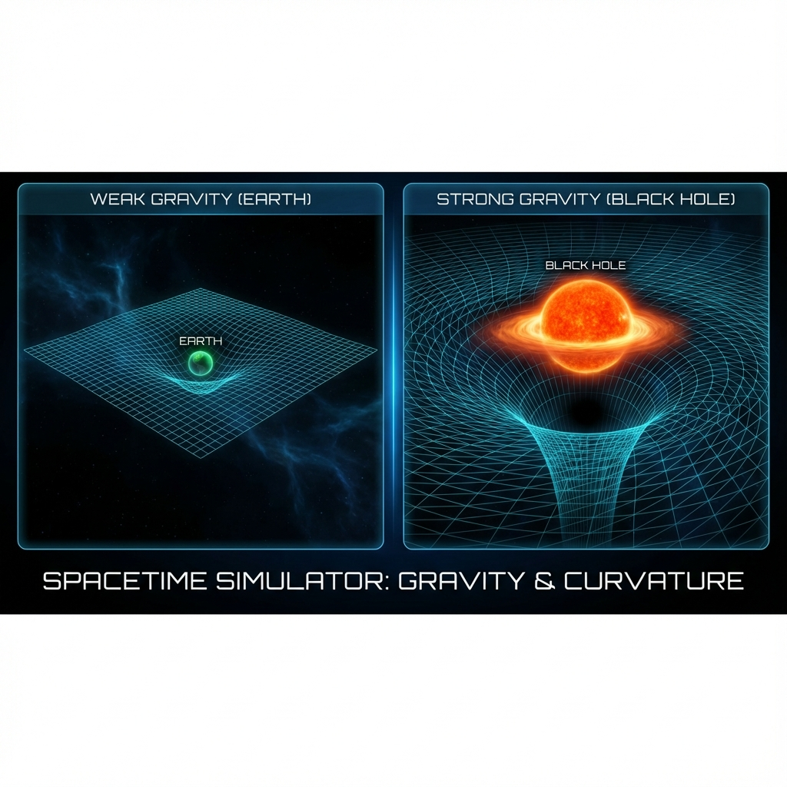
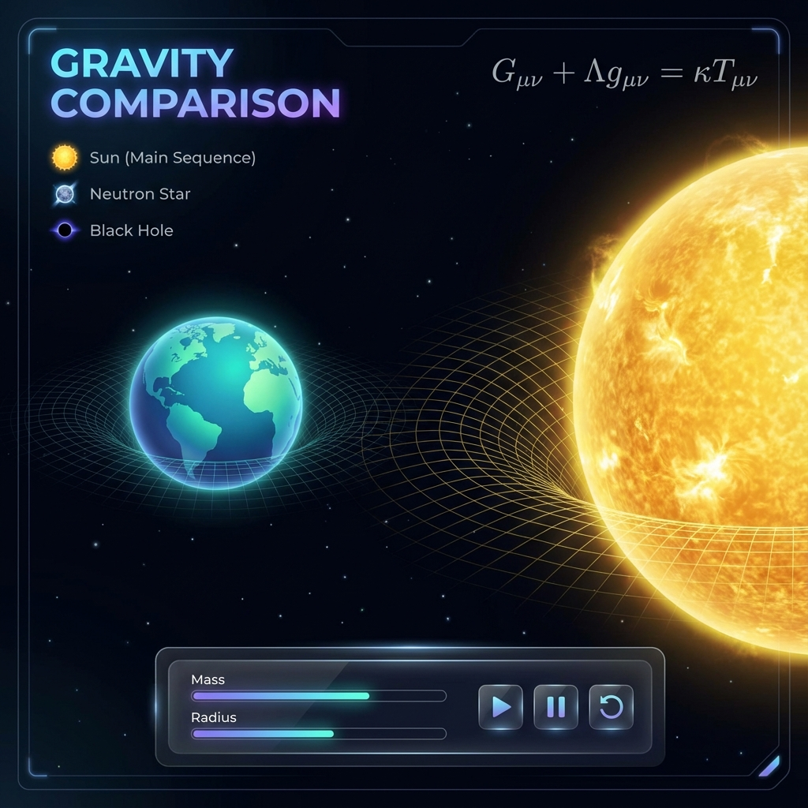
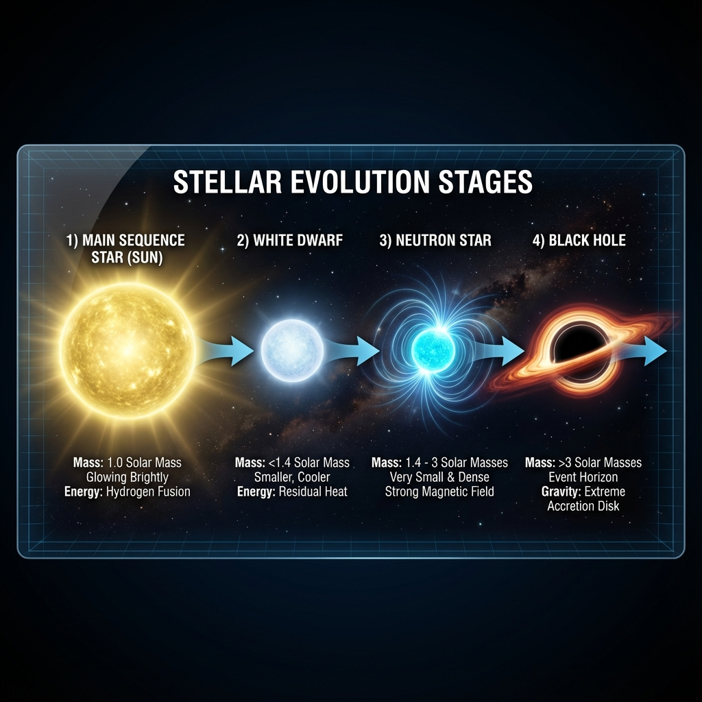

# 🌌 Spacetime Curvature Evolution

<div align="center">



**An interactive 3D visualization comparing Earth's gravity with stellar evolution and spacetime curvature**

[](https://react.dev/)
[](https://threejs.org/)
[](https://www.typescriptlang.org/)
[](https://vitejs.dev/)

[Demo](#-features) • [Installation](#-installation) • [Usage](#-usage) • [Physics](#-the-physics) • [Contributing](#-contributing)

</div>

---

## 🚀 Overview

**Spacetime Curvature Evolution** is an educational physics simulation that visualizes how mass curves spacetime according to Einstein's General Theory of Relativity. Watch in real-time as a stellar object evolves from a Sun-like star through various stages - White Dwarf, Neutron Star, and finally a Black Hole - while comparing its gravitational effects against Earth's relatively minimal spacetime curvature.

This interactive WebGL application uses **React Three Fiber** to render dynamic 3D spacetime grids that warp and bend in response to increasing mass, providing an intuitive understanding of one of the universe's most fundamental concepts.

---

## ✨ Features



### 🎯 Core Capabilities

- **Dual Comparison View**: Side-by-side visualization of Earth (static) vs. an evolving stellar object
- **Real-time Stellar Evolution**: Watch mass increase from 1.0 to 8.0 solar masses
- **Dynamic Spacetime Warping**: 3D wireframe grids that deform based on gravitational field strength
- **Physics-Accurate Transitions**: Observes Chandrasekhar Limit (1.4 M☉) and TOV Limit (~2.8 M☉)
- **Interactive Controls**: Play, Pause, and Reset the simulation at any time
- **Educational Overlay**: Live display of Einstein Field Equations and stellar stage information
- **Downloadable Source Code**: Export the entire project as a ZIP file directly from the app

### 🎨 Visual Design

- Premium glassmorphism UI with backdrop blur effects
- Animated progress bars tracking mass and radius
- Color-coded stellar stages with smooth transitions
- Curvature intensity indicator
- Responsive design for desktop and mobile

---

## 🌟 The Physics



### Einstein's Field Equations

The simulation is based on Einstein's Field Equations:

```
Gμν + Λgμν = κTμν
```

Where:
- **Gμν** = Einstein tensor (describes spacetime curvature)
- **Λ** = Cosmological constant
- **gμν** = Metric tensor
- **κ** = Einstein's constant (8πG/c⁴)
- **Tμν** = Stress-energy tensor (describes matter/energy distribution)

### Stellar Evolution Stages

1. **Main Sequence Star (Sun)**: 1.0 - 1.4 M☉
   - Yellow-gold coloring
   - Moderate spacetime curvature
   
2. **White Dwarf**: 1.4 - 2.8 M☉
   - Pale blue coloring
   - Increased density, smaller radius
   - Crosses Chandrasekhar Limit

3. **Neutron Star**: 2.8 - ~3.0 M☉
   - Cyan coloring
   - Extreme density
   - Approaches TOV Limit

4. **Black Hole**: > 3.0 M☉
   - Red/orange accretion disk visualization
   - Maximum spacetime curvature
   - Event horizon formation

### Schwarzschild Radius

The event horizon radius is calculated using:

```
rs = 2GM/c²
```

Where G is the gravitational constant, M is mass, and c is the speed of light.

---

## 📦 Installation

### Prerequisites

- **Node.js** (v18 or higher recommended)
- **npm** or **pnpm**

> ⚠️ **Known Issue**: Node.js v25+ has compatibility issues with Rollup. Please use Node.js LTS (v20 or v22) for best results.

### Setup

1. **Clone the repository**
   ```bash
   git clone https://github.com/yourusername/spacetime-curvature-evolution.git
   cd spacetime-curvature-evolution
   ```

2. **Install dependencies**
   ```bash
   npm install
   ```

3. **Set up environment variables**
   
   Create a `.env.local` file and add your Gemini API key:
   ```
   GEMINI_API_KEY=your_api_key_here
   ```

4. **Run the development server**
   ```bash
   npm run dev
   ```

5. **Open in browser**
   
   Navigate to `http://localhost:5173`

---

## 🎮 Usage

### Controls

| Button | Action |
|--------|--------|
| **▶ SIMULATE** | Start the stellar evolution simulation |
| **⏸ PAUSE** | Pause the simulation at current state |
| **🔄 RESET** | Return to initial conditions (1.0 M☉) |
| **📥 Download** | Export source code as ZIP file |

### Observing the Simulation

1. **Start**: Click "SIMULATE" to begin
2. **Watch**: Observe how the right-side object evolves and how its spacetime grid warps
3. **Compare**: Notice the stark difference between Earth's minimal curvature (left) and the stellar object's increasing curvature (right)
4. **Monitor**: Track real-time mass, radius, and stellar stage in the UI overlays

---

## 🛠️ Tech Stack

| Technology | Purpose |
|------------|---------|
| **React 18** | UI framework |
| **TypeScript** | Type-safe development |
| **Three.js** | 3D graphics engine |
| **React Three Fiber** | React renderer for Three.js |
| **React Three Drei** | Useful helpers for R3F |
| **Vite** | Build tool and dev server |
| **Lucide React** | Icon library |
| **JSZip** | Source code export functionality |

---

## 📁 Project Structure

```
spacetime-curvature-evolution/
├── src/
│   ├── components/
│   │   ├── CelestialBody.tsx       # Renders stars/planets
│   │   ├── SimulationCanvas.tsx    # Main 3D scene
│   │   ├── SpacetimeMesh.tsx       # Warped grid geometry
│   │   └── Overlay.tsx             # UI controls & info
│   ├── utils/
│   │   ├── physics.ts              # Physics calculations
│   │   └── sourceCode.ts           # Code export utility
│   ├── constants.ts                # Physics constants
│   └── types.ts                    # TypeScript definitions
├── docs/                           # Documentation assets
├── App.tsx                         # Root component
├── index.tsx                       # Entry point
└── vite.config.ts                  # Build configuration
```

---

## 🎨 Customization

### Adjusting Simulation Parameters

Edit `constants.ts` to customize:

```typescript
// Simulation speed (higher = faster evolution)
export const SIMULATION_SPEED = 0.001;

// Mass range (in solar masses)
export const INITIAL_MASS = 1.0;
export const MAX_MASS = 8.0;

// Grid visualization
export const GRID_SIZE = 40;
export const GRID_SEGMENTS = 200;
```

### Changing Colors

Modify stage colors in `constants.ts`:

```typescript
export const STAGE_COLORS = {
  [StellarStage.SUN]: '#FDB813',
  [StellarStage.NEUTRON_STAR]: '#00FFFF',
  [StellarStage.BLACK_HOLE]: '#FF3300'
};
```

---

## 🧪 Building for Production

```bash
npm run build
```

This creates an optimized production build in the `dist/` directory.

To preview the production build locally:

```bash
npm run preview
```

---

## 🐛 Troubleshooting

### Vite/Rollup Error on Windows (Node v25)

**Error**: `Cannot find module @rollup/rollup-win32-x64-msvc`

**Solution**: Use Node.js LTS version (v20 or v22), or use `pnpm` instead of `npm`:

```bash
npm install -g pnpm
pnpm install
pnpm run dev
```

### Black screen or rendering issues

- Ensure your browser supports WebGL
- Update your graphics drivers
- Try disabling browser extensions

---

## 🤝 Contributing

Contributions are welcome! Please feel free to submit a Pull Request. For major changes:

1. Fork the repository
2. Create your feature branch (`git checkout -b feature/AmazingFeature`)
3. Commit your changes (`git commit -m 'Add some AmazingFeature'`)
4. Push to the branch (`git push origin feature/AmazingFeature`)
5. Open a Pull Request

---

## 📚 Educational Resources

- [Einstein's General Relativity](https://en.wikipedia.org/wiki/General_relativity)
- [Stellar Evolution](https://imagine.gsfc.nasa.gov/science/objects/stars2.html)
- [Black Holes Explained](https://www.nasa.gov/black-holes)
- [Chandrasekhar Limit](https://en.wikipedia.org/wiki/Chandrasekhar_limit)
- [Tolman–Oppenheimer–Volkoff Limit](https://en.wikipedia.org/wiki/Tolman%E2%80%93Oppenheimer%E2%80%93Volkoff_limit)

---

## 📄 License

This project is licensed under the **MIT License** - see the [LICENSE](LICENSE) file for details.

---

## 🙏 Acknowledgments

- Inspired by real astrophysics simulations and educational visualizations
- Built with the amazing React Three Fiber community
- Einstein for the equations ⚛️

---

<div align="center">

**Made with ❤️ and ⚛️ Physics**

If you found this educational, please ⭐ star the repository!

[Report Bug](https://github.com/yourusername/spacetime-curvature-evolution/issues) • [Request Feature](https://github.com/yourusername/spacetime-curvature-evolution/issues)

</div>
